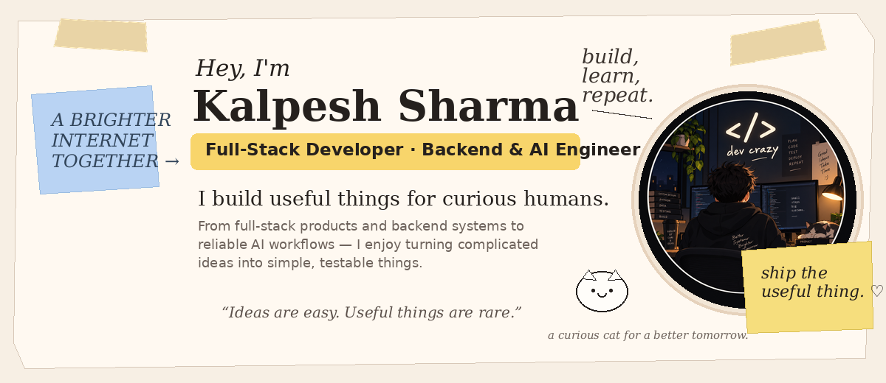
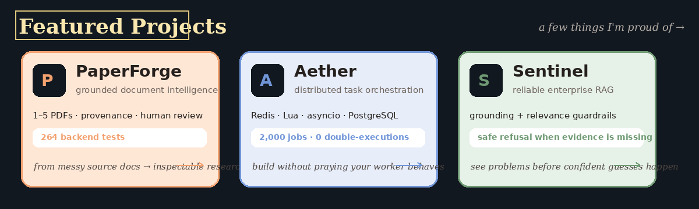
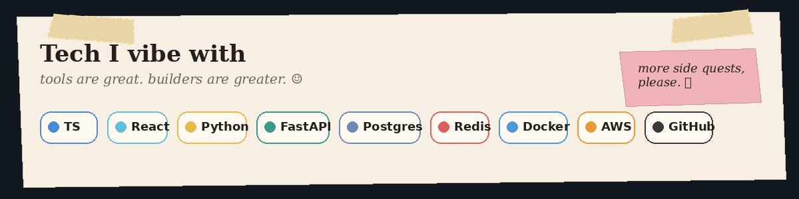
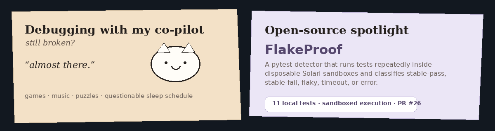

<p align="center">
  
</p>

<p align="center">
  <a href="https://kalpeshsharma.in"><b>Portfolio</b></a>
  &nbsp;&nbsp;•&nbsp;&nbsp;
  <a href="https://www.linkedin.com/in/kalpeshsharma862/"><b>LinkedIn</b></a>
  &nbsp;&nbsp;•&nbsp;&nbsp;
  <a href="https://x.com/K2Chaturvedi"><b>X - @K2Chaturvedi</b></a>
  &nbsp;&nbsp;•&nbsp;&nbsp;
  <a href="mailto:skalpesh2199@gmail.com"><b>Email</b></a>
</p>

<p align="center">
  <i>building useful things where the interesting part starts after the UI.</i>
</p>

---

## featured projects

<p align="center">
  
</p>

<table>
<tr>
<td width="33%" valign="top">

### [PaperForge](https://github.com/Kalpesh1Sharma/paperforge)

**Full-stack document intelligence.**

Source PDFs → grounded synthesis → traceable report → precise edit → human review → verified DOCX.

`React` `TypeScript` `FastAPI` `PyMuPDF` `AI`

</td>
<td width="33%" valign="top">

### [Aether](https://github.com/Kalpesh1Sharma/Aether)

**Distributed task orchestration.**

Atomic Redis/Lua claiming, async workers, retries, DLQ, crash recovery and measurable execution guarantees.

`FastAPI` `Redis` `Lua` `PostgreSQL` `asyncio`

</td>
<td width="33%" valign="top">

### [Sentinel](https://github.com/Kalpesh1Sharma/sentinel-support-agent)

**Reliable enterprise RAG.**

Retrieval with explicit grounding + relevance checks and safe refusal when the evidence is not there.

`Python` `FastAPI` `FAISS` `RAG` `Docker`

</td>
</tr>
</table>

## tech, but without the badge wall

<p align="center">
  
</p>

<details>
<summary><b>what sits behind the pretty note</b></summary>
<br/>

- **Product:** React, TypeScript, JavaScript
- **Backend:** Python, FastAPI, REST APIs, WebSockets, asyncio
- **Data:** PostgreSQL, MySQL, SQL Server, Redis
- **AI:** RAG, LangChain, LangGraph, FAISS, multi-agent systems
- **Systems:** Redis Pub/Sub, Lua scripts, DAG pipelines, Docker
- **Cloud / delivery:** AWS, GCP, GitHub Actions, CI/CD

</details>

## activity pulse

A small profile-owned visual generated from recent public GitHub events — not another contribution snake.

<p align="center">
  
</p>

<sub>generated inside this profile repository and refreshed by GitHub Actions</sub>

## side quests & open source

<p align="center">
  
</p>

**[FlakeProof → solari-cookbook PR #26](https://github.com/solari-sdk/solari-cookbook/pull/26)**  
A pytest detector for repeated isolated execution inside disposable Solari micro-VMs.

---

```text
kalpesh@github:~$ philosophy

ship the useful thing.
measure the hard thing.
document the weird thing.
keep the cat away from the keyboard.
```

<p align="center">
  <sub>games · music · puzzles · small systems turning into suspiciously large repositories</sub>
</p>
