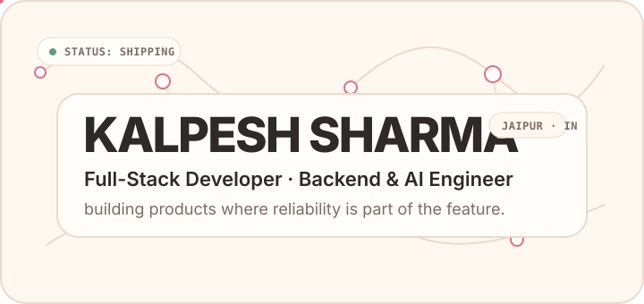
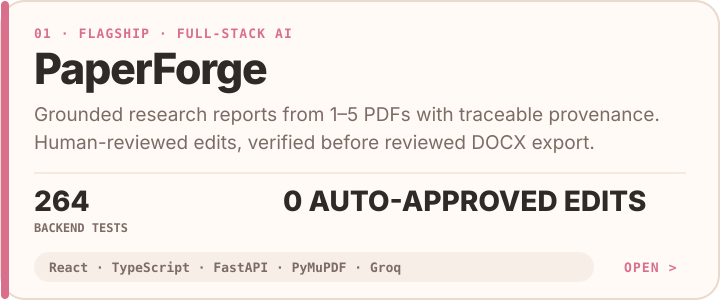
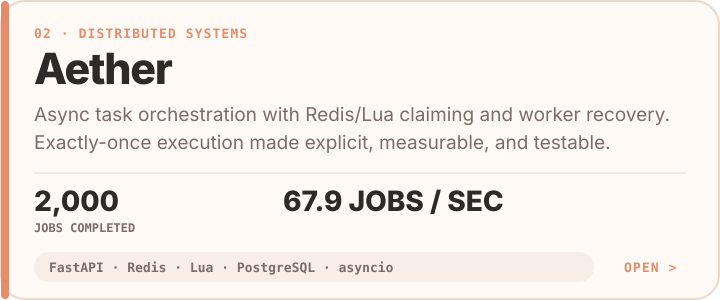
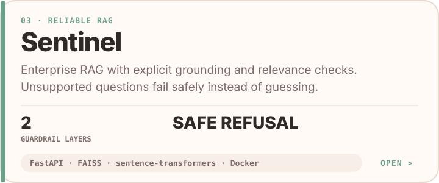
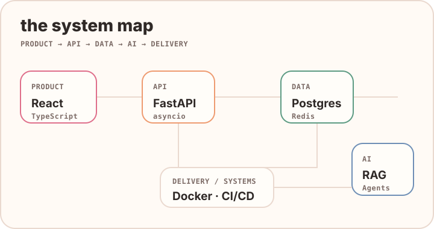

<p align="center">
  
</p>

<p align="center">
  <a href="https://kalpeshsharma.in"><b>portfolio ↗</b></a>
  &nbsp;&nbsp;·&nbsp;&nbsp;
  <a href="https://www.linkedin.com/in/kalpeshsharma862/"><b>linkedin ↗</b></a>
  &nbsp;&nbsp;·&nbsp;&nbsp;
  <a href="https://x.com/K2Chaturvedi"><b>X - @K2Chaturvedi ↗</b></a>
  &nbsp;&nbsp;·&nbsp;&nbsp;
  <a href="mailto:skalpesh2199@gmail.com"><b>email ↗</b></a>
</p>

<br/>

I like building things where the interesting part starts **after the UI** — queues, orchestration, provenance, retrieval, async systems, reliability, and the product layer that makes all of it useful.

My current lane is **full-stack development + backend systems + applied AI**. I care less about stacking buzzwords and more about being able to explain what the system does when workers race, providers fail, evidence is missing, or a human needs to stay in control.

> **currently:** shipping better developer products, going deeper on distributed systems, and turning “small side projects” into repositories at unreasonable hours.

## selected work

<a href="https://github.com/Kalpesh1Sharma/paperforge">
  
</a>

<a href="https://github.com/Kalpesh1Sharma/Aether">
  
</a>

<a href="https://github.com/Kalpesh1Sharma/sentinel-support-agent">
  
</a>

## how I build



<details>
<summary><b>the stack, without the logo wall</b></summary>
<br/>

- **Product:** React, TypeScript, JavaScript
- **Backend:** Python, FastAPI, REST APIs, WebSockets, asyncio
- **Data:** PostgreSQL, MySQL, SQL Server, Redis
- **AI:** RAG, LangChain, LangGraph, FAISS, multi-agent systems
- **Systems:** Redis Pub/Sub, Lua scripts, DAG pipelines, Docker
- **Cloud / delivery:** AWS, GCP, GitHub Actions, CI/CD

</details>

## activity pulse

Not another contribution snake. This is a tiny profile-owned visual generated from my **recent public GitHub events** and refreshed automatically by GitHub Actions.


<sub>updated daily · generated by <code>scripts/generate_activity.py</code> · no third-party stats service</sub>

## open source

**FlakeProof** — a pytest detector that repeatedly executes tests inside disposable Solari sandboxes and classifies them as stable-pass, stable-fail, flaky, timeout, or error.

<a href="https://github.com/solari-sdk/solari-cookbook/pull/26"><b>solari-cookbook · PR #26 ↗</b></a>

<br/><br/>

```text
kalpesh@github:~$ philosophy

ship the useful thing.
measure the hard thing.
document the weird thing.
never trust "works on my machine."
```

<p align="center">
  <sub>outside code → gaming · music · probably debugging something that worked 10 minutes ago</sub>
</p>
